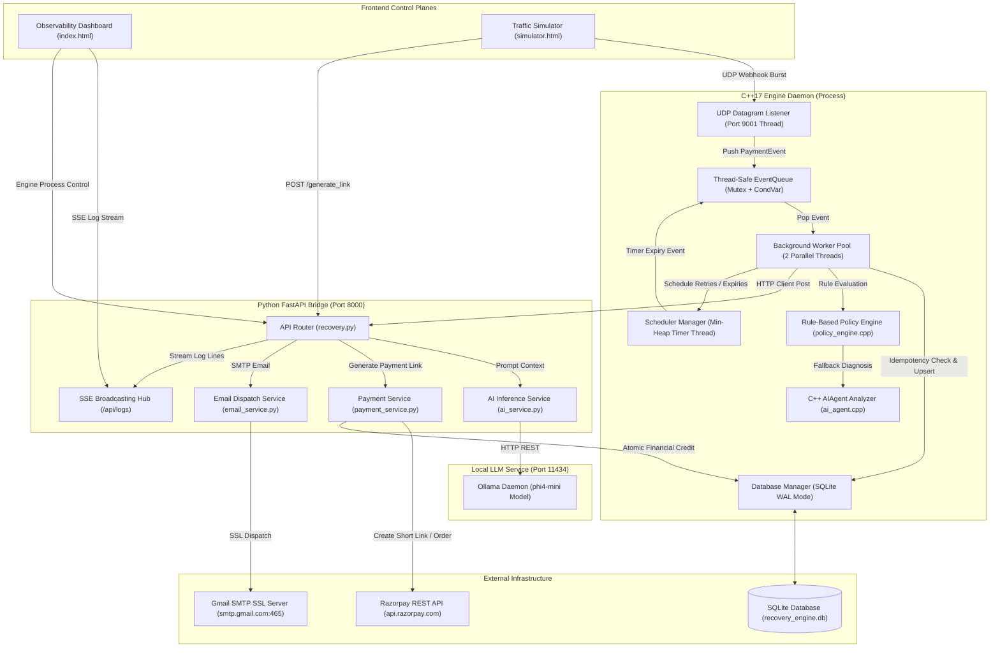
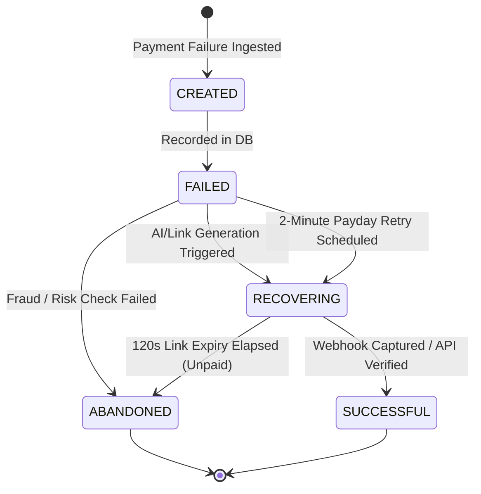

<h1 align="center">[ Reclaim - AI Revenue Recovery Engine ]</h1>

<p align="center">
  <i>Enterprise-Grade, High-Throughput AI-Augmented Payment Recovery Engine for Razorpay Ecosystems</i>
</p>

<p align="center">
  
  
  
  
  
  
</p>

---

<h2 align="center">System Overview</h2>

<details open>
<summary><b>System Architecture & Core Design</b></summary>

<br />

#### **What it is:**
- An enterprise-grade **dual-engine architecture** combining a zero-latency C++ core daemon with an asynchronous Python FastAPI bridge.
- A high-throughput event processor capable of ingesting payment failure webhooks via UDP datagrams at **15-20 events/ms**.
- An intelligent recovery workflow enforcing rule-based policies and AI diagnosis via **Ollama (`phi4-mini`)** or **Gemini AI**.
- A real-time observability control plane with live financial ledger tracking (`Revenue at Risk` vs. `Revenue Recovered`).

#### **What it isn't:**
- A generic wrapper around payment gateways.
- A naive polling loop that spams customer endpoints.
- A single-threaded script - Reclaim uses thread-safe queues, min-heap schedulers, and WAL-mode SQLite databases.

</details>

<details open>
<summary><b>Key Features & Technical Capabilities</b></summary>

<br />

- **Zero-Latency UDP Ingestion**: High-speed C++ datagram listener (`port 9001`) for instant failure event capture without HTTP overhead.
- **Idempotency Guard**: Dual-layer (in-memory + persistent SQLite) event deduplication preventing double processing or multiple link generation.
- **Smart-Path AI Classification**: Categorizes errors into `GENERATE_NEW_LINK`, `SCHEDULE_PAYDAY_RETRY`, or `ABANDON` (risk check failure).
- **Non-Blocking Timer Scheduler**: Min-heap scheduled retries and 120-second link expiry enforcement.
- **Real-Time SSE Dashboard**: Server-Sent Events stream live C++ process logs directly to the browser UI.

</details>

---

<h2 align="center">System Matrix & Architecture</h2>

### System Core Component Matrix

| Component | Interface / Port | Technology Stack | Core Role |
| :--- | :---: | :--- | :--- |
| **C++ Core Daemon** | UDP `9001` | C++17, Pthreads, SQLite WAL | Event Queueing, Idempotency, Min-Heap Scheduling, Policy Engine |
| **FastAPI Bridge** | HTTP `8000` | Python 3.10+, FastAPI, Uvicorn | Smart-Path Routing, SSE Log Streaming, Subprocess Control |
| **Local LLM Engine** | HTTP `11434` | Ollama (`phi4-mini`) | Local AI Diagnosis & Failure Reason Classification |
| **Observability Dashboard** | Web `/` | HTML5, Vanilla JS, SSE | Dual-Pane Log Visualization & Process Lifecycle Control |
| **Traffic Simulator** | Web `/simulator` | HTML5, Canvas, Web Socket/UDP | High-Throughput Burst Event Generation (15-20 events/ms) |

<br />

### End-to-End System Topology



<br />

### Payment Lifecycle State Machine



---

<h2 align="center">Quick Start Guide</h2>

| Step | Action | Requirements & Output |
| :---: | :--- | :--- |
| **01** | **Prerequisites Setup** | C++17 Compiler (`g++`/`clang++`), CMake, Python 3.10+, `libsqlite3-dev`, `libssl-dev` |
| **02** | **Environment Config** | Copy template `.env.example` -> `.env` and fill API credentials |
| **03** | **C++ Engine Compilation** | Run `cmake .. && make -j$(nproc)` in `build/` directory |
| **04** | **Launch FastAPI Bridge** | Activate `.venv`, install requirements, run `python -m api_bridge.main` |

<br />

#### 1. Environment Configuration
```bash
cp .env.example .env
```

#### 2. Build C++ Engine Daemon
```bash
mkdir -p build && cd build
cmake ..
make -j$(nproc)
cd ..
```

#### 3. Launch FastAPI Bridge & Dashboard
```bash
# Setup virtual environment
python3 -m venv .venv
source .venv/bin/activate

# Install dependencies
pip install fastapi uvicorn razorpay google-genai requests

# Launch API Bridge
python -m api_bridge.main
```

Access the **Observability Dashboard** at `http://localhost:8000` and the **Traffic Simulator** at `http://localhost:8000/simulator`.

---

<h2 align="center">Repository Directory Layout</h2>

```
revenue_recovery/
├── api_bridge/              # FastAPI bridge, routers, and services
│   ├── config.py            # Environment configuration loader (.env auto-load)
│   ├── main.py              # Application entry point
│   ├── routers/             # API routes (recovery, checkout)
│   └── services/            # Services (AI, Payment, Email)
├── frontend/                # Control planes & UI dashboards
│   ├── index.html           # Observability Dashboard
│   └── simulator.html       # Traffic Simulator
├── include/                 # C++ header files
├── src/                     # C++ core daemon implementation
├── CMakeLists.txt           # CMake build configuration
├── .env.example             # Safe version-controlled environment template
├── .gitignore               # Security & build ignore rules
└── README.md                # Main repository documentation
```

---

<h2 align="center">Credits & Open Source Acknowledgments</h2>

| Open Source Library | Original Author | Purpose & Integration | Project Link |
| :--- | :--- | :--- | :---: |
| **`cpp-httplib`** | Yuji Hirose ([@yhirose](https://github.com/yhirose)) | Single-header C++11 HTTP/HTTPS client & server library for low-latency IPC communication | [Repository](https://github.com/yhirose/cpp-httplib) |
| **`nlohmann/json`** | Niels Lohmann ([@nlohmann](https://github.com/nlohmann)) | Modern C++ header-only JSON parser for structured datagram payload processing | [Repository](https://github.com/nlohmann/json) |

---

<p align="center">
  <sub>Engineered for high-availability digital payment infrastructure. Distributed under the MIT License.</sub>
</p>
